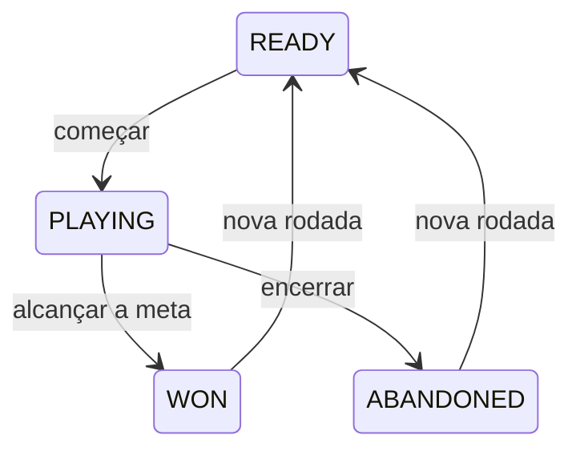

# Jogo de Cliques · Android

[](https://github.com/fbottega-dev/jogo-apl-moveis-kotlin/actions/workflows/android.yml)

Jogo Android em Kotlin e Jetpack Compose. Cada rodada sorteia uma meta de 1 a 50 cliques; o jogador acompanha o progresso, pode encerrar a rodada e começar outra.

Antes de começar, escolha o nível: **fácil (1–10), médio (11–30) ou difícil (31–50)**. A escolha vale para as próximas rodadas e é preservada ao girar a tela. O nível só pode ser alterado antes do início da rodada.

## Melhorias nesta versão

- Uma única estrutura de projeto na raiz; a cópia duplicada foi removida.
- Regras imutáveis em GameSession, independentes de Android e testáveis em JVM.
- Rodada e contador de vitórias preservados na recriação da Activity por rememberSaveable.
- Interface Material 3 com barra de progresso, botão de toque acessível e suporte a rolagem.
- Strings extraídas para recursos; imagens originais preservadas.
- CI compila APK debug, executa testes e Android Lint.

## Executar

Abra **a raiz deste repositório** no Android Studio e aguarde o Gradle Sync.

- JDK 21 para o Gradle; Android SDK 34 e Build Tools 34.
- Android Gradle Plugin 8.5.0, Gradle 8.7 e Kotlin 1.9.0.
- Android 7.0 / API 24 ou superior no emulador ou aparelho.

Selecione o módulo app e clique em Run. O SDK pode ser indicado pelo Android Studio em local.properties, que não deve ser commitado.

## Testes e APK

```powershell
.\gradlew.bat testDebugUnitTest lintDebug assembleDebug
```

Linux/macOS: `chmod +x gradlew && ./gradlew testDebugUnitTest lintDebug assembleDebug`.

O APK fica em `app/build/outputs/apk/debug/app-debug.apk`. No GitHub, abra uma execução bem-sucedida de **Actions → Android CI → Artifacts → jogo-cliques-debug** para baixar o pacote. É um APK de desenvolvimento, não uma publicação na Play Store.

Os 10 testes verificam regras da rodada e níveis de dificuldade: faixas sem sobreposição, metas sorteadas dentro dos limites e independência entre rodadas. Lint foi executado sem erros; ainda há avisos de dependências/recursos do projeto original.

## Estados



## Limitações e evolução

- Não foi validado em aparelho/emulador nesta entrega; build, testes JVM e lint foram executados.
- O contador não é um histórico permanente após fechar o aplicativo; persistência com DataStore é uma próxima melhoria.
- Próximos passos: testes Compose, histórico permanente de vitórias e imagens otimizadas para diferentes densidades.
- Não há serviços remotos, anúncios ou coleta de dados implementados.

[Uso de IA e revisão](docs/AI_USAGE.md)
